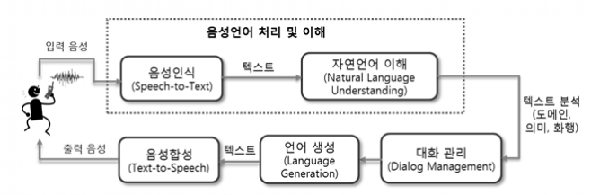
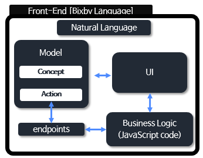
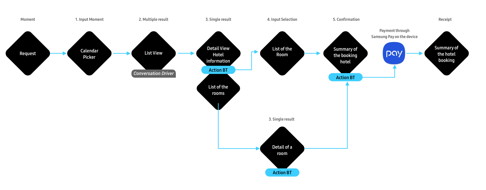

오늘 면접관님한테 인생조언 듣고 시작하는 TIL ㅠㅠ

면접볼때 빅스비 얘기하는데 STT가 뭔지 정확히 기억이 안나서 버벅인 김에 빅스비 정리를 하려고 한다.

# STT

## STT란

STT(Speech-to-Text), Voice Recognition 또는 인공 청각이라고도 표현합니다. 뜻 그대로 사람의 음성 인터페이스를 통해 텍스트(문자) 데이터를 추출해내는 것이죠. 현재는 다양한 플랫폼과 서비스들에 상용화되어 있기에 보다 쉽게 접할 수 있는 기술입니다.

그렇지만 STT 기술은 어느 날 갑자기 툭 하고 나타난 것이 아니며, 음성인식의 역사는 1950년대까지 거슬러 올라가야 합니다. 미국에서는 사람이 말하는 모습을 X레이로 촬영하고 목소리의 구조를 조사하는 연구가 활발히 진행되었습니다. 소리를 낼 때의 변화를 확인 하고 그것을 수학적으로 기술하고자 한 것입니다. 여기서 나온 수식 모델에 소리를 합성하면 음성 합성이 되고, 입력된 음성이 어떤 모델에 가까운가를 살펴보면 음성인식이 가능하다고 믿었던 것입니다.

그 외에 1963년 IBM이 음성으로 영단어 16개를 인식하는 것은 물론 간단한 숫자 계산까지 해주는 ‘슈박스(Shoebox)’라는 음성인식 기기를 공개하였으며, 그 이후에도 음성인식에 대한 연구는 계속 되고 있습니다. 오늘날에는 고성능 GPU 및 클라우드 서버 등 여러 HW적인 발전과 분산 처리 기술과 같은 기술력 덕에 음성인식 기술이 더욱이 빠르게 발전 및 대중화되고 있습니다.

## STT 기술

사람들은 마주 보고 앉아 대화할 때와 전화 통화를 할 때, 의사 소통에 많은 차이를 느낍니다. 표정과 입모양, 손짓 등 다양한 비언어적 요소가 대화에 있어 55% 정도의 많은 부분을 차지하고 있기 때문입니다. 그러나 STT 기술에서는 이러한 비언어적 요소 없이 음성만으로 어떻게 정확한 내용을 처리해낼 수 있을까요?

### STT 핵심 기술 요소

STT를 위한 데이터에는 크게 음향학적 관점과 언어학점 관점으로 볼 수 있습니다. 음향학점 관점은 말하는 이, 공간, 노이즈 등의 환경적인 데이터가 주를 이루고 언어학적 관점에서는 어휘, 문맥, 문법 등을 모델링하기 위한 언어 데이터가 주를 이룹니다.

STT는 크게 음성/언어 데이터로부터 인식 네트워크 모델을 생성하는 오프라인 학습 단계와 사용자가 발성한 음성을 인식하는 온라인 탐색 단계로 나뉩니다. STT 엔진은 음성과 언어 데이터의 사전 지식을 사용해서 음성 신호로부터 문자 정보를 출력하는데 이 때 해석이라는 차원에서 STT 알고리즘을 디코더(Decoder)라고도 부릅니다. 디코딩 단계에서는 학습 단계 결과인 음향 모델(Acoustic Model), 언어 모델(Language Model)과 발음 사전(Pronunciation Lexicon)을 이용하여 입력된 특징 벡터를 모델과 비교, 스코어링(Scoring)하여 단어 열을 최종 결정 짓습니다.

음향 모델링은 해당 언어의 음운 환경별 발음의 음향적 특성을 확률 모델로 대표 패턴을 생성하는 과정이고, 언어모델링은 어휘 선택, 문장 단위 구문 구조 등 해당 언어의 사용성 문제에 대해 문법 체계를 통계적으로 학습하는 과정입니다. 또한 발음 사전 구축을 위해서는 텍스트를 소리 나는 대로 변환하는 음소 변환(Grapheme-to-Phoneme) 구현 과정이 필요하며, 표준 발음을 대상으로 하는 발음 변환 규칙만으로는 방언이나 사용자의 발화 습관과 어투에 따른 다양한 패턴을 반영하기 어려운 경우가 있어 별도의 사전 구축이 필요하게 됩니다.

## STT 성능

STT의 성능은 DB 크기와 품질에 비례하여 향상될 수 있습니다. 상용 서비스에 적용되는 음향 모델의 대부분 확률 통계 방식인 HMM(Hidden Markov Model) 기반으로 이루어졌으며, 2010년대 들어서면서 딥러닝 기반으로 HMM/DNN 방식으로 단어 인식 오류를 개선하여 20%의 성능 향상을 이루어냈습니다. 이는 기존 HMM의 각 상태 확률 분포를 모델링하는 데 사용되는 GMM을 DNN으로 대체하는 것으로, 그 외의 모델 구분 단위, 단위별 학습 자료 자동 생성 및 모델 결합을 통한 문장 인식 확장 등은 HMM에서의 방식을 다수 그대로 사용하는 반면 DNN을 추정해야 하는 파라미터가 많아 학습 시간이 많이 소요됩니다.

최근에는 시퀀스-투-시퀀스(Sequence-to-Sequence) 방식의 RNN(Recurrent Neutral Network) 기반으로 속도와 성능 면에서 좋은 결과를 가져왔습니다. 음성 인식에서도 번역어(End-to-End) 학습 방식의 발전으로 일련의 오디오 특징을 입력으로 일련의 글자(character) 또는 단어들을 출력으로 하는 단일 함수를 학습할 수 있게 되었습니다. 또한 CTC(Connectionist Temporal Classification) 이라는 모델로 입력 데이터와 레이블 사이의 음성 정렬(alignment) 정보가 없어도 학습이 가능하게 되었습니다. 이와 같은 다양한 학습법을 통해 계속해서 STT의 성능은 향상되고 있습니다.

# Bixby

## Bixby 구조

### Capsule이란

Bixby를 통해 사용자에게 제공하는 서비스 단위

## Bixby 구성요소

### Modeling

- Concept, Action

### Business Logic

- Javascript

### UI

- Dialog, Layout, Follow-Up

### Natural Language

- Vocabulary, Training data

### EndPoints

- 모델링한 Action과 Business Logic을 연결해주는 역할
