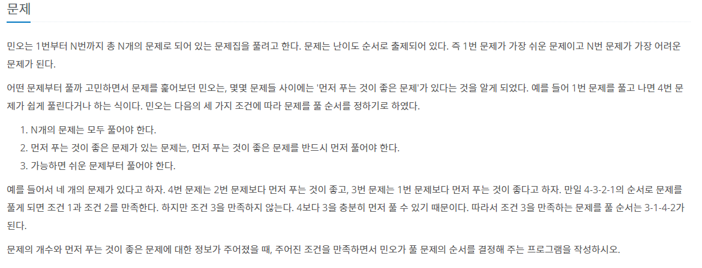

오늘은 쿠팡 코테 대비 겸 알고리즘 학습으로 위상정렬에 대해 공부해볼까 한다.

# 위상정렬(Topological Sort)

## 위상정렬이란

```
위상 정렬(topological sorting)은 유향 그래프의 꼭짓점들(vertex)을 변의 방향을 거스르지 않도록 나열하는 것을 의미한다. 위상정렬을 가장 잘 설명해 줄 수 있는 예로 대학의 선수과목(prerequisite) 구조를 예로 들 수 있다. 만약 특정 수강과목에 선수과목이 있다면 그 선수 과목부터 수강해야 하므로, 특정 과목들을 수강해야 할 때 위상 정렬을 통해 올바른 수강 순서를 찾아낼 수 있다. 이와 같이 선후 관계가 정의된 그래프 구조 상에서 선후 관계에 따라 정렬하기 위해 위상 정렬을 이용할 수 있다. 정렬의 순서는 유향 그래프의 구조에 따라 여러 개의 종류가 나올 수 있다. 위상 정렬이 성립하기 위해서는 반드시 그래프의 순환이 존재하지 않아야 한다. 즉, 그래프가 비순환 유향 그래프(directed acyclic graph)여야 한다.

일반적인 위상 정렬의 적용은 주로 업무의 일정을 일어나야 할 순서에 따라 배치하기 위하는 것으로, 이 알고리즘은 프로젝트 관리 기법을 평가 및 분석하기 위한 기법(PERT)에 적용하기 위한 목적을 위해 1960년대 초반부터 연구되었다 (Jarnagin 1960). 이 때, 해당 업무는 꼭짓점으로 표현되었고, 각 꼭짓점을 연결하는 변은 해당 업무 간의 선후 관계를 표현하였다. 가령, 옷을 다리기 위한 업무는 반드시 옷을 세탁기에 돌리는 업무 뒤에 배치되어야 한다. 이와 같이, 위상정렬은 각 업무를 수행하기 위한 순서를 제공하였다.
- wiki
```

위상정렬이란 순서가 정해져 있는 작업을 차례로 수행할 때, 그 순서를 정해주는 알고리즘이다.

하나의 경로만 존재하는 것이 아니라 여러 가지의 답이 나올 수 있다.

사이클이 존재하지 않는 방향 그래프에만 적용할 수 있다.

## 위상정렬 원리

1. 진입차수가 0인(시작점) 노드를 큐에 삽입
2. 큐에서 원소를 꺼내 연결된 간선 모두 제거
3. 진입차수가 0이 된 다른 정점들을 큐에 넣음
4. 큐가 빌 때까지 2-3 반복

-> 큐에서 꺼낸 순서가 위상정렬의 결과가 된다.

## 구현

[문제집](https://www.acmicpc.net/problem/1766)



```java
import java.io.BufferedReader;
import java.io.IOException;
import java.io.InputStreamReader;
import java.util.ArrayList;
import java.util.List;
import java.util.PriorityQueue;
import java.util.StringTokenizer;

public class Main_1766 {
	static int N,M;
	public static void main(String[] args) throws IOException {
		BufferedReader br = new BufferedReader(new InputStreamReader(System.in));
		StringTokenizer st = new StringTokenizer(br.readLine());

		N = Integer.parseInt(st.nextToken());
		M = Integer.parseInt(st.nextToken());
		List<Integer>[] problemList = new ArrayList[N+1];
		int[] indegree = new int[N+1]; // 진입차수를 저장하는 배열
		for (int i = 1; i <= N; i++)
			problemList[i] = new ArrayList<>();

		for (int i = 0; i < M; i++) {
			st = new StringTokenizer(br.readLine());
			int s = Integer.parseInt(st.nextToken());
			int e = Integer.parseInt(st.nextToken());
			problemList[s].add(e); //
			indegree[e]++;
		}
        // end input

		topologicalSort(problemList, indegree);
	}

	private static void topologicalSort(List<Integer>[] problemList, int[] indegree) {
		PriorityQueue<Integer> pq = new PriorityQueue<>();
        // 제한사항 2를 해결하기 위해 Priority Queue를 사용한다.

		StringBuilder sb = new StringBuilder();
		for (int i = 1; i <= N; i++) {
			if(indegree[i] == 0) pq.offer(i); // 진입차수가 0인 노드 삽입
		}

		while(!pq.isEmpty()) {
			int curNode = pq.poll();

			for (Integer next : problemList[curNode]) {
				indegree[next]--; // 연결된 간선 제거

				if(indegree[next] == 0) pq.offer(next); // 진입차수가 0이 된 노드 삽입
			}
			sb.append(curNode + " ");
		}
		System.out.println(sb.toString());
	}
}

```
