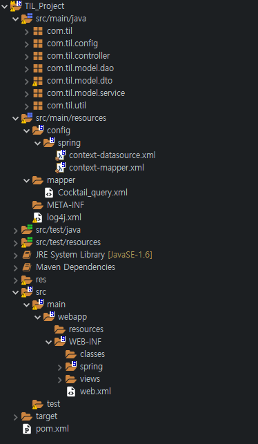

오늘부터 스터디겸 React - Spring Legacy로 간단한 칵테일 프로젝트를 해볼까 한다.

React는 아예 안써봤고 Legacy는 가물가물해서 빠르게는 못 끝내겠지만 시작해보자!

우선 개발 툴은 Backend는 STS4, Frontend는 vs Code, DB는 MySQL로 진행할 예정이다


### Backend 설정

#### Spring Legacy 프로젝트 생성


#### Spring MVC Project 생성


#### Encoding 설정


Window - Preferences로 들어가서 encoding을 검색하면 이 화면이 나온다.
여기서 Workspace, CSS, HTML, JSP files를 UTF-8로 바꿔준다.


### Backend 구조
기본적인 프로젝트의 구조는 다음과 같다.



1. src/main/java
   - java 파일들이 들어있는 디렉토리
   - 기본 mvc 구조로 진행할 생각이고
   - config : swagger, util : xml -> 객체로 바꿔줄 parser
2. src/main/resources
   - config/spring : db 설정
   - mapper : MyBatis 설정
   - log4j.xml : 로그 설정 위한 xml파일
3. src/main/webapp/web.xml
   - encodingFilter와 resources안에 있는 context파일 설정을 해줄 파일
4. pom.xml
   - maven의 dependency 설정을 위한 파일

#### context-datasource.xml
```xml
<?xml version="1.0" encoding="UTF-8"?>
<beans xmlns="http://www.springframework.org/schema/beans"
    xmlns:xsi="http://www.w3.org/2001/XMLSchema-instance"
    xsi:schemaLocation="http://www.springframework.org/schema/beans http://www.springframework.org/schema/beans/spring-beans-3.0.xsd
                        http://www.springframework.org/schema/jdbc  http://www.springframework.org/schema/jdbc/spring-jdbc-3.0.xsd">
 
	<bean id="dataSource" class="org.apache.commons.dbcp.BasicDataSource" destroy-method="close"> 
		<!-- connectdb, username, password 자신에 맞게 수정-->
		<property name="driverClassName" value="com.mysql.cj.jdbc.Driver"/> 
		<property name="url" value="jdbc:mysql://localhost:3306/connectdb?serverTimezone=UTC&amp;useSSL=false"/> 
		<property name="username" value="username"/> 
		<property name="password" value="password"/> 
	</bean> 
</beans>
```

#### context-mapper.xml
```xml
<?xml version="1.0" encoding="UTF-8"?>
 <beans xmlns="http://www.springframework.org/schema/beans" 
 xmlns:xsi="http://www.w3.org/2001/XMLSchema-instance" 
 xmlns:context="http://www.springframework.org/schema/context" 
 xsi:schemaLocation="http://www.springframework.org/schema/beans http://www.springframework.org/schema/beans/spring-beans.xsd http://www.springframework.org/schema/context http://www.springframework.org/schema/context/spring-context.xsd"> 
	 <bean id="sqlSession" class="org.mybatis.spring.SqlSessionFactoryBean"> 
		 <property name="dataSource" ref="dataSource" /> 
		 <!-- mapperLocations는 mybatis query와 매칭시킬 파일을 지정해준다.-->
		 <property name="mapperLocations" value="classpath:/mapper/*_query.xml" /> 
	 </bean>
	 <bean id="sqlSessionTemplate" class="org.mybatis.spring.SqlSessionTemplate"> 
	 	<constructor-arg index="0" ref="sqlSession"/> 
	 </bean> 
 </beans>
```

#### web.xml
```xml
<?xml version="1.0" encoding="UTF-8"?>
<web-app version="2.5" xmlns="http://java.sun.com/xml/ns/javaee"
	xmlns:xsi="http://www.w3.org/2001/XMLSchema-instance"
	xsi:schemaLocation="http://java.sun.com/xml/ns/javaee https://java.sun.com/xml/ns/javaee/web-app_2_5.xsd">

	<context-param>
		<param-name>contextConfigLocation</param-name>
		<!-- resource 폴더 아래에 있는 context 파일 이름을 매칭시켜준다.-->
		<param-value>/WEB-INF/spring/context-*.xml</param-value>
	</context-param>
	
	<listener>
		<listener-class>org.springframework.web.context.ContextLoaderListener</listener-class>
	</listener>

	<servlet>
		<servlet-name>appServlet</servlet-name>
		<servlet-class>org.springframework.web.servlet.DispatcherServlet</servlet-class>
		<init-param>
			<param-name>contextConfigLocation</param-name>
			<param-value>/WEB-INF/spring/appServlet/servlet-context.xml</param-value>
		</init-param>
		<load-on-startup>1</load-on-startup>
	</servlet>
		
	<servlet-mapping>
		<servlet-name>appServlet</servlet-name>
		<url-pattern>/</url-pattern>
	</servlet-mapping>
	
	<!-- encodingFilter를 위한 설정-->
	<filter>
	 <filter-name>encodingFilter</filter-name> 
	 <filter-class> org.springframework.web.filter.CharacterEncodingFilter </filter-class> 
	 <init-param> 
	 <param-name>encoding</param-name> 
	 <param-value>utf-8</param-value> 
	 </init-param> 
	 </filter> 
	 <filter-mapping> 
	 <filter-name>encodingFilter</filter-name> 
	 <url-pattern>*.do</url-pattern> 
	 </filter-mapping>
</web-app>
```
#### [pom.xml](https://github.com/LeeGeunSeong/TIL_Project/blob/master/pom.xml)


오늘은 backend 기본 설정으로 마치고 내일부터 본격적인 개발에 들어가겠다!

github Link: [github 링크](https://github.com/LeeGeunSeong/TIL_Project)